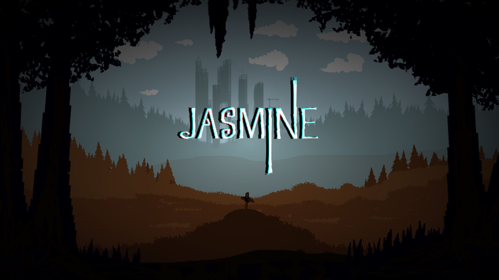
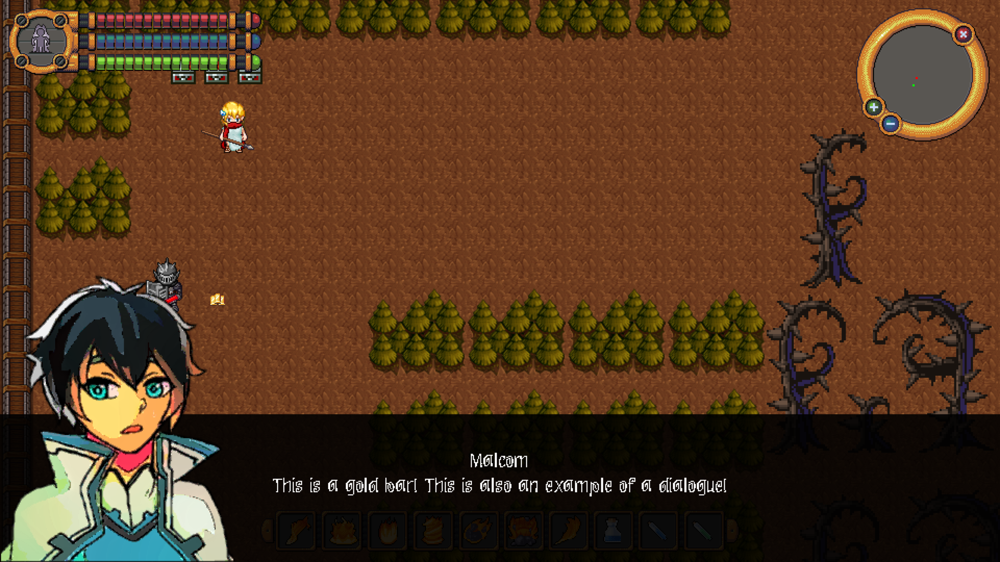
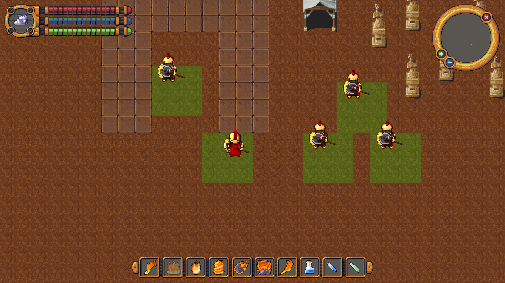
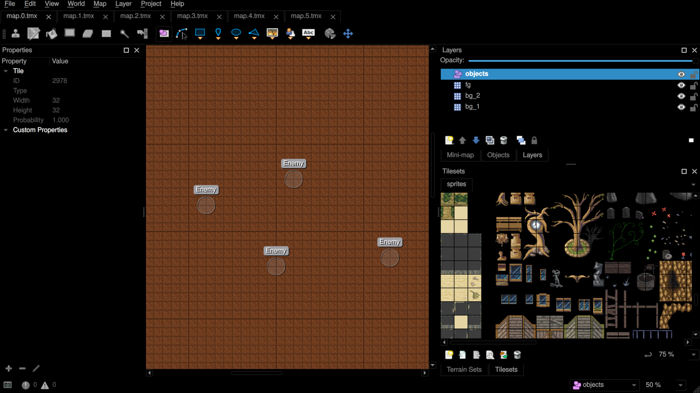

# Jasmine

<p></p>

This is an incomplete single player action RPG written in C++23. I wrote it in a few days as an experience for me to learn about 2D game programming using SDL2. Though some basic features already exist, it is mostly unfinished and contains many bugs.

<p style="display: flex; flex-wrap: wrap; gap: 4px">
  
  
  
</p>

## Features

- You can create maps in `Tiled`
- You can move around
- You can consume mana to use skills
- You can attack enemies
- You can see damage above characters
- You can shoot projectiles
- You can move to higher levels and other maps

## TODO

I only wanted to spend a few days on this project so I only managed to complete a prototype. If I find some free time in the future I will try to add the following:

- There are no actual stories/quests/maps right now; add and refine them
- Projectiles should be triggered without requiring auto-attack
- Create treasure boxes to find gold
- Path-finding; allow enemies to seek out player and vice-versa

## Getting Started

```
git clone https://github.com/kaiyanlee/jasmine
cd jasmine
mkdir build
cd build
cmake .. && make
./jasmine
```

## Dependencies

- Clang or GCC compiler with C++23 support
- CMake
- OpenGL
- zlib
- RapidJSON
- SDL2

## Installation

Jasmine only _officially_ supports desktop Linux platforms but all of its dependencies are cross-platform so YMMV.

## Tutorial

The game has its own tutorial but here is a quick run through of the shortcuts:

- Click anywhere on the start/menu screen to start the game
- UP/w, LEFT/a, DOWN/s, RIGHT/d for movement
- P to pause
- F to auto-attack nearby enemies
- I to open inventory/status

## Credits

This project uses a lot of free content from OpenGameArt and LPC. I took the resources and optimized them for usage in Jasmine as sprites. I do not own any of the original artwork so you are free to use the derivatives under their original license (Creative Commons). Here are the references:

- Background sprites are from [Hyptosis](https://opengameart.org/content/lots-of-free-2d-tiles-and-sprites-by-hyptosis)
- Character sprites are from [Universal Sprite Sheet](https://github.com/sanderfrenken/Universal-LPC-Spritesheet-Character-Generator);
- UI icons are from [7Soul1](https://opengameart.org/content/496-pixel-art-icons-for-medievalfantasy-rpg)
- Menu background image is from [trulio](https://opengameart.org/content/forest-and-grave)
- Sounds are from [Kenney](https://opengameart.org/content/50-rpg-sound-effects)
- Music is from [OveMelea](https://opengameart.org/content/oves-essential-game-audio-pack-collection-160-files-updated)
- Particles sprites are from [JoesAlotofthings](https://opengameart.org/users/joesalotofthings)
- Character portraits are from [ZeNeRIA29](https://opengameart.org/content/anime-portrait-for-lpc-characters)

## License

The source code for this project is licensed under GPLv3 and the media files are licensed under different creative commons licenses (see above for more information). All trademarks are property of their respective owners.
